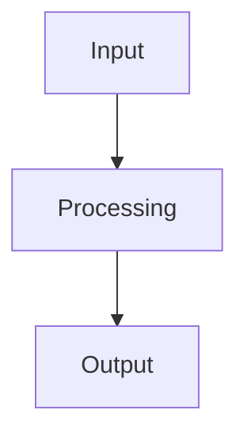

---
tags:
  - research
  - analysis
  - benchmark
status: draft
date: 2026-03-06
---

# Benchmark Analysis

## Overview

This research note documents the benchmark analysis for trading signal performance evaluation.

## Related Sessions

- [[Session-274]] - Latest session findings
- [[Session-273]] - Previous session baseline

> [!tip] Getting Started
> This is a placeholder for benchmark analysis tips. Replace this content with specific guidance on interpreting the benchmark results, key metrics to focus on, and recommended thresholds for evaluation.

## Processing Pipeline

## Analysis

*Add analysis content here.*
