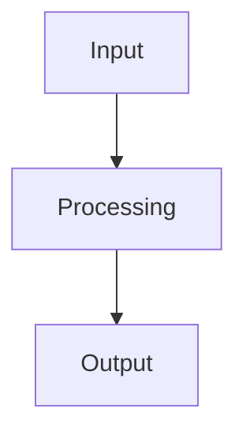

# Benchmark Analysis

This research note provides a benchmark analysis framework for evaluating model performance across key metrics. It builds on findings from [[Session-274]] and [[Session-273]] to establish baseline comparisons.

## Overview

The benchmark analysis evaluates pipeline stages from data ingestion through final output, measuring performance at each step to identify bottlenecks and optimization opportunities.

> [!tip] Getting Started
> Use this note as a template for structured benchmark comparisons. Fill in each section with actual measurements from your experimental runs. Cross-reference session logs for historical context.

## Pipeline Flowchart

## Methodology

### Data Sources

- Benchmark datasets from previous sessions
- Cross-referenced with [[Session-274]] regressor results
- Baseline metrics from [[Session-273]] feature analysis

### Evaluation Criteria

| Metric | Description | Target |
|--------|-------------|--------|
| Latency | End-to-end processing time | TBD |
| Throughput | Records processed per second | TBD |
| Accuracy | Model prediction quality | TBD |

## Results

*Placeholder: Add benchmark results here.*

## Next Steps

- [ ] Run initial benchmark suite
- [ ] Compare against [[Session-274]] baselines
- [ ] Document findings in follow-up session

## Related

- [[Session-274]] -- Regressor backtests and IC analysis
- [[Session-273]] -- Per-direction feature flags and AUC analysis
