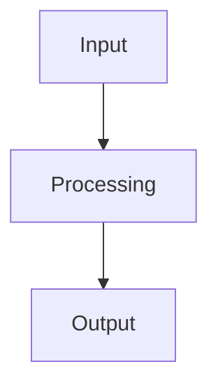

# Benchmark Analysis

## Overview

This note documents benchmark analysis findings. Related session logs: [[Session-274]] and [[Session-273]].

## Key Findings

> [!tip] Placeholder
> Add benchmark results and key findings here as analysis progresses.

## Workflow

## Notes

- Compare against baseline metrics
- Document methodology and parameters
- Track performance across iterations
