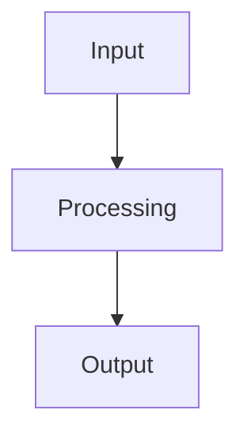

# Benchmark Analysis

## Overview

This note documents the benchmark analysis research. See related session logs: [[Session-274]] and [[Session-273]].

> [!tip] Placeholder
> This is a placeholder for additional tips and insights to be added as the analysis progresses.

## Workflow

## Notes

- Linked sessions: [[Session-274]], [[Session-273]]
